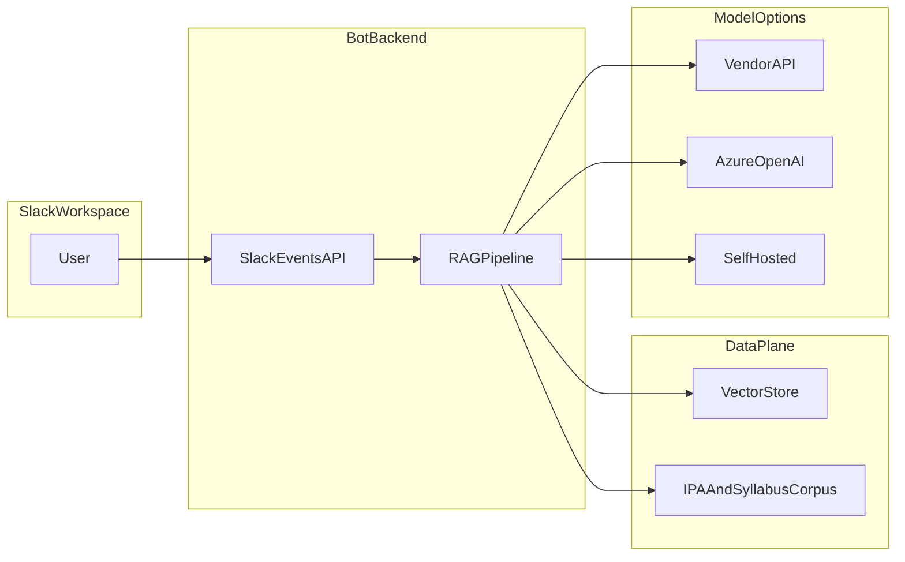

# 企画書兼要件定義書：社内Slack 基本情報技術者試験学習支援ボット（RAG）

| 項目 | 内容 |
|------|------|
| 文書種別 | 企画書（第1部）／要件定義（第2部） |
| 版 | 1.1 |
| 日付 | 2026-04-05 |
| ステータス | 上長承認依頼用ドラフト |

**読み方**：第 1〜4 章と第 13 章をまず通読すれば意思決定に必要な情報に揃う。第 5〜12 章は実装・運用・法務のたたき台として参照する。**社内固有の値はすべて §1.4 の表に集約**してあり、面談や稟議前にそこだけ埋めればよい。

---

## 目次

1. [エグゼクティブサマリ](#1-エグゼクティブサマリ)
2. [背景・課題](#2-背景課題)
3. [提案概要](#3-提案概要)
4. [スコープ（MVP とフェーズ）](#4-スコープmvp-とフェーズ)
5. [機能要件](#5-機能要件)
6. [非機能要件](#6-非機能要件)
7. [データ・法務・コンプライアンス](#7-データ法務コンプライアンス)
8. [システム構成案の比較](#8-システム構成案の比較)
9. [セキュリティ・プライバシー](#9-セキュリティプライバシー)
10. [運用設計](#10-運用設計)
11. [スケジュール・マイルストーン](#11-スケジュールマイルストーン)
12. [リスクと対策](#12-リスクと対策)
13. [承認依頼事項（チェックリスト）](#13-承認依頼事項チェックリスト)
14. [付録：README との対応](#14-付録readme-との対応)

---

## 1. エグゼクティブサマリ

### 1.1 一文要約

社内 Slack 上で、基本情報技術者試験（以下 FE）の学習を支援する RAG 型ボットを提供し、**用語理解・過去問演習・解説**を通じて学習の習慣化と合格に向けた効率化を図る。

### 1.2 目的（README との整合）

元コンセプト（リポジトリ [README.md](../README.md)）は「学生向け」としていたが、本企画では **社内メンバー**（新卒・キャリア入社・異動者、非情報系を含む）を主対象とする。提供価値は次のとおり。

- FE 合格に必要な用語・問題パターンへのアクセスを **日常の Slack から** 可能にする。
- 学習のきっかけを増やし、**継続（習慣化）** を支援する。
- **共有チャンネルでの可視化**：あるメンバーが「分からない」とした用語・問題が、ボットの応答とともにスレッドとして残るため、**他メンバーも同じ論点を後から確認**できる。自分だけでは気づきにくい疑問を他者が先に質問してくれることで学習の抜け漏れを減らし、必要なら**同僚の補足や「ここがポイント」といった短い議論**につなげて理解を深められる（DM のみの利用と比べた差分として明確）。

### 1.3 承認いただきたい事項（概要）

| No. | 依頼事項 |
|-----|----------|
| A | 社内 Slack ワークスペースへの **カスタムアプリ（ボット）導入** の許可 |
| B | 利用する **クラウド／外部 API** の方針（下記 8 章のいずれか、または段階導入）の承認 |
| C | **月額コスト上限** または PoC 期間の予算枠の明示 |
| D | **IPA 等の第三者素材** を学習コーパスに含めることに関する **法務レビュー** の実施 |
| E | プロダクトオーナー（窓口）と **運用責任者** の指名（または暫定担当の承認） |

### 1.4 社内文脈の記入欄（対話・社内調整で確定）

以下は **貴社実情に合わせて差し替え** する。

| 項目 | 記入例（削除して差し替え） |
|------|---------------------------|
| 対象部門・想定人数 | 新入社員 20 名、全社任意利用 |
| 利用チャンネル | `#セゾンテクノロジー新人研修2026_FE`、DM 可否 |
| 成功指標（KPI） | 週次アクティブユーザー 10 名以上、基本情報資格試験合格者9割以上 |
| 月額コスト上限 | 例：PoC 3 か月は 3 万円以内、本番は別途申請 |
| Slack アプリ管理者 | 例：情報システム部 承認のうえ、〇〇がオーナー |

---

## 2. 背景・課題

### 2.1 想定される課題（テンプレート）

社内で次のようなニーズ・課題がある場合、本ボットは補完的に効く。

- FE 取得が採用時・配属時の期待に含まれるが、**独学の道筋が分かりにくい**。
- 業務多忙で学習時間が断片化し、**教材を開くハードル** が高い。
- 用語と過去問を横断的に確認するのに **検索コスト** がかかる。

### 2.2 本提案で解くこと

- **アクセス性**：既に開いている Slack から質問・演習ができる。
- **一貫性**：シラバス・用語・過去問を RAG で根拠付きに近い形で提示しやすい（設計次第）。
- **習慣化**：短時間のインタラクションを繰り返しやすい UI（スラッシュコマンド、ショートカット等は実装フェーズで定義）。
- **集合学習（サイレント・ラーニング）**：教材サイトや個人向けアプリと異なり、**質問とボット回答がチャンネル履歴として残る**。質問した本人の理解整理に加え、**閲覧だけのメンバーも「自分も不安だった箇所」を確認し直す**きっかけになる。運用で学習用チャンネルを推奨し、メンターがスレッドに一言添えることで、**同じ疑問を繰り返し聞くコスト**を下げつつチーム全体の理解を揃えやすい。

### 2.3 対象者の定義（要件）

| 区分 | 内容 |
|------|------|
| 主対象 | FE の取得を目指す社内メンバー（職種・部門は 1.4 で確定） |
| 副次 | メンター・教育担当がボット回答を教材補助として参照（想定） |

---

## 3. 提案概要

### 3.1 サービスイメージ

- Slack 上のボットが、**用語説明**、**過去問の出題**、**正解・解説の提示（科目 B を含む）** を行う。
- 裏側では **検索拡張生成（RAG）** により、登録したコーパス（IPA 公開物、シラバス、用語典など）に基づき回答を生成する。
- **チャンネル利用を前提とした価値**：やり取りは（ポリシーに従い）**学習用の共有チャンネル**で行う想定とし、他メンバーがタイムラインや検索で同じ Q&A にアクセスできる。これにより「自分だけが分からなかった」状態を、**チームで確認・再説明・補足**しやすくする。機密性や恥ずかしさの観点で DM を併用する場合でも、**匿名性は担保されない**ため、チャンネル運用ルールは §1.4・§5.2 と合わせて決める。

### 3.2 データの流れ（論理）

---

## 4. スコープ（MVP とフェーズ）

### 4.1 MVP（第1段階）

| 領域 | MVP に含める |
|------|----------------|
| 用語解説 | シラバス／用語典ベースの説明、出典の簡易表示 |
| 過去問出題 | **限定範囲**（例：直近 N 年の午前／科目 A のみ）からランダムまたは指定 |
| 問題解説 | 正誤と理由のテキスト解説（科目 B は **簡易版** から開始可） |

**過去問の年度・分野の線引き** は 1.4 の社内合意または試験戦略に合わせて確定する。

### 4.2 フェーズ2（MVP 安定後）

- 科目 B の図表・長文に近い問題への対応強化。
- ユーザーの弱点分野に応じた出題バイアス。
- 利用ログに基づく改善（個人を特定しない集計のみ）。

### 4.3 スコープ外（明示）

- 試験の **替え玉問題の提供** や、IPA 素材の **社外再配布用ファイルの生成・配布**。
- 社内機密文書・個人データをコーパスに混ぜること（原則禁止。7 章参照）。

---

## 5. 機能要件

### 5.1 機能一覧

| ID | 機能名 | 概要 | 優先度 |
|----|--------|------|--------|
| F-01 | 用語解説 | ユーザーが用語を入力すると、定義・補足・参照出典を返す | MVP 必須 |
| F-02 | 過去問出題 | 出題モードで問題文（および選択肢）を提示 | MVP 必須 |
| F-03 | 解答・解説 | ユーザーの解答に対し正誤と解説を返す。科目 B 対応 | MVP 必須（科目 B は段階的に品質目標を上げる） |
| F-04 | 出典表示 | 回答に参照したコーパス断片または文書名を表示 | MVP 推奨 |
| F-05 | 利用ガイド | `/help` 等で使い方・免責を表示 | MVP 必須 |

### 5.2 ユースケース例

| UC | 主体 | トリガー | 基本フロー |
|----|------|----------|------------|
| UC-01 | 学習者 | チャンネルまたは DM で用語を質問 | ボットが RAG で回答 → 出典表示 |
| UC-02 | 学習者 | 「過去問」と指示 | ボットが問題提示 → ユーザー解答 → 解説 |
| UC-03 | 学習者 | 科目 B 形式の問題を指定 | 長文読解に対応した回答（フェーズで拡張） |

**チャンネル方針**（公開／非公開、DM 許可）は Slack ガバナンスに従い 1.4 で確定する。

---

## 6. 非機能要件

### 6.1 可用性（README「24/365」との整理）

README の「基本的に 24 時間 365 日稼働」は、**運用上の目標** として次のように定義する（コストとトレードオフのため **段階設定** を推奨）。

| 段階 | 目標 | 備考 |
|------|------|------|
| PoC | 営業日の主要時間帯（例：平日 8–22 時 JST）の利用に耐える | 手動起動・単一リージョン可 |
| 本番 | 月間稼働率 **99.0%** 以上（計画メンテは週 0.5 時間以内を事前告知） | マルチ AZ 等は構成案に依存 |

### 6.2 性能・操作性

| 項目 | 目標（初期） |
|------|----------------|
| 応答時間（p95） | 10〜30 秒以内（モデル・検索構成により変動。PoC で実測し改定） |
| 同時利用 | 社内想定人数に対し、レート制限で公平性を担保 |

### 6.3 コスト（README「コストはできるだけ抑える」との整理）

| 方針 | 内容 |
|------|------|
| 原則 | **月額上限** を 1.4 で設定し、アラートで超過を検知 |
| 技術 | 小規模ベクタ DB、キャッシュ、バッチ埋め込み、安価な推論モデルの併用を検討 |
| 可変費 | トークン課金の場合、**1 ユーザーあたり上限** または **ワークスペース合計上限** をアプリ側で設定 |

### 6.4 その他

| 項目 | 要件 |
|------|------|
| 監査 | 障害・コスト異常のログを保持（保持期間は 9 章と整合） |
| 法令・社内規程 | 個人情報を学習に流さない、生成 AI 利用ポリシーに準拠 |

---

## 7. データ・法務・コンプライアンス

### 7.1 想定コーパス（README 準拠）

- IPA が公開している過去問（PDF／テキスト等）
- IPA の公式シラバス
- オープンな IT 用語辞典等（ライセンス確認のうえ）

### 7.2 法務上の確認事項（承認前チェック）

| 確認項目 | 内容 |
|----------|------|
| IPA 素材の利用条件 | **最新の利用規約・注意書き** を確認し、社内利用・ボット経由の利用が許容される範囲を法務と整理 |
| 改変・要約 | 自動要約・再構成が条件に抵触しないか |
| 表示義務 | 出典・著作権表示の要否を遵守 |
| 第三者用語典 | 各データセットのライセンス（商用／改変／クレジット） |

※ 本書は **法的結論を代替しない**。最終判断は法務・IPA 公開情報に基づく。

### 7.3 社内データの扱い

- **社内機密・個人情報を RAG コーパスに含めない**（原則）。
- ユーザーが問題文に個人情報を貼り付けた場合は **ログに残さない／マスキング** 方針を運用で定義（9 章）。

---

## 8. システム構成案の比較

### 8.1 共通コンポーネント

- Slack App（Events API、必要に応じてショートカット／スラッシュコマンド）
- アプリケーションバックエンド（HTTP エンドポイント、署名検証）
- 埋め込みパイプラインとベクタストア
- LLM 呼び出し層

### 8.2 構成案の比較表

| 評価軸 | 案 A：社外 API 利用可 | 案 B：契約クラウド内のみ（例：Azure OpenAI） | 案 C：VPC／オンプレモデル |
|--------|----------------------|-----------------------------------------------|---------------------------|
| 概要 | OpenAI 等のパブリック API を利用 | 企業契約のクラウド内エンドポイントのみ | 自社環境で推論・埋め込み |
| データレジデンシー | ベンダー規約に依存 | 契約リージョンで制御しやすい | 最も厳格に制御可能 |
| 初期コスト・工数 | 低め | 中程度 | 高め（GPU・運用） |
| 品質・更新 | モデル更新が速い | 企業向けモデルで十分なことが多い | 自前チューニングが必要 |
| 運用 | シンプル | 中程度 | 重い |

### 8.3 推奨される意思決定プロセス

1. PoC は **案 B または A** で短期間に価値検証（セキュリティ審査に合わせる）。
2. データ取扱ポリシーが厳格化された場合に **案 C** を検討。
3. いずれも **API キー・トークンは環境変数またはシークレット管理に集約**し、リポジトリにハードコードしない（9.2）。

### 8.4 技術スタック（確定は実装フェーズ）

README の「システム構成、技術スタック」は未記載のため、実装時に次を決定する。

- 言語・フレームワーク（例：Node／Python）
- ホスティング（コンテナ、サーバレス）
- ベクタ DB 製品

---

## 9. セキュリティ・プライバシー

### 9.1 脅威と対策（概要）

| 脅威 | 対策 |
|------|------|
| Slack リクエストの偽装 | Signing Secret による署名検証 |
| シークレット漏洩 | env／Vault、ローテーション、最小権限 |
| プロンプトインジェクション | システムプロンプト設計、出力フィルタ、参照範囲の限定 |
| 過度な利用 | レート制限、コストアラート |

### 9.2 秘密情報の取り扱い（必須ポリシー）

- **パスワード、API キー、トークンをアプリケーションコードにハードコードしない。**
- 本番・ステージングともに **環境変数またはクラウドのシークレット管理** に集約する。

### 9.3 ログ・プライバシー

| 項目 | 方針 |
|------|------|
| メッセージ本文 | 障害調査に必要な最小限。可能ならハッシュ化または短い保持 |
| 保持期間 | 例：90 日（社内規程に合わせて確定） |
| 第三者提供 | 学習用にベンダーへ送らない設定（利用規約で確認） |

---

## 10. 運用設計

| 項目 | 内容 |
|------|------|
| オーナー | 1.4 で指名。一次対応窓口を明記 |
| 障害連絡 | 社内インシデントフローに乗せるか、専用チャンネルを設ける |
| 変更管理 | コーパス更新（IPA の新年度公開時）、モデルバージョン変更 |
| バックアップ | ベクタインデックス再生成可能なソースの保管 |

---

## 11. スケジュール・マイルストーン

| フェーズ | 内容 | 目安（開始から） |
|----------|------|------------------|
| M0 | 承認（本チェックリスト）、法務確認着手 | 週 0 |
| M1 | Slack アプリ登録、開発環境、コーパス取り込み PoC | 週 1–2 |
| M2 | MVP 機能（F-01〜03）をステージングで社内限定公開 | 週 3–6 |
| M3 | KPI 測定、コスト・品質のレビュー | 週 7–8 |
| M4 | 本番リリースまたは拡大 | 週 9〜 |

日付の固定は **プロジェクトキックオフ日** を基準に社内で置換する。

---

## 12. リスクと対策

| リスク | 影響 | 確率 | 対策 |
|--------|------|------|------|
| IPA 等の利用条件によりコーパス利用が制限される | 機能縮小または中止 | 中 | 事前法務確認、代替公開データの検討 |
| LLM の誤答（ハルシネーション） | 誤学習、信頼低下 | 中 | 免責表示、出典提示、人間による教材確認の推奨 |
| コスト超過 | 予算圧迫 | 中 | 上限・アラート、モデル段階化 |
| Slack API 変更・レート制限 | サービス低下 | 低 | SDK 更新、バックオフ |
| セキュリティインシデント | 情報漏えい | 低 | 9 章の対策、定期見直し |

---

## 13. 承認依頼事項（チェックリスト）

上長・関係部門は、以下にチェック（承認／条件付き／却下）いただく。

| # | 項目 | 承認欄 |
|---|------|--------|
| 1 | 本企画の目的・スコープ（第 4 章） | |
| 2 | Slack カスタムアプリの作成・インストール | |
| 3 | 利用チャンネル方針（公開範囲・DM） | |
| 4 | 構成案（8.2）の選定または PoC での暫定案 | |
| 5 | 月額コスト上限・アラート閾値 | |
| 6 | 法務レビュー（IPA・用語典・生成 AI ポリシー） | |
| 7 | ログ保持・個人情報の非取り込み方針（9 章） | |
| 8 | プロダクトオーナー・運用窓口（1.4） | |
| 9 | スケジュール（11 章）の妥当性 | |

**承認者**

| 役割 | 氏名 | 日付 | 署名 |
|------|------|------|------|
| 上長 | | | |
| 情報システム（必要時） | | | |
| 法務（必要時） | | | |

---

## 14. 付録：README との対応

| README 記載 | 本書での扱い |
|-------------|----------------|
| 目的・ターゲット | 1.2、2 章（社内向けに言い換え） |
| 用語／過去問／解説（科目 B） | 5 章 |
| 24/365・低コスト | 6 章（SLO とコスト上限に分解） |
| データソース | 7 章 |
| システム構成・技術スタック | 8 章（案比較と未確定事項として記載） |

---

## 改訂履歴

| 版 | 日付 | 変更内容 |
|----|------|----------|
| 1.1 | 2026-04-05 | 共有チャンネルによる集合学習・可視化のメリットを §1.2・§2.2・§3.1 に追記 |
| 1.0 | 2026-04-05 | 初版（企画書兼要件定義） |

以上。
